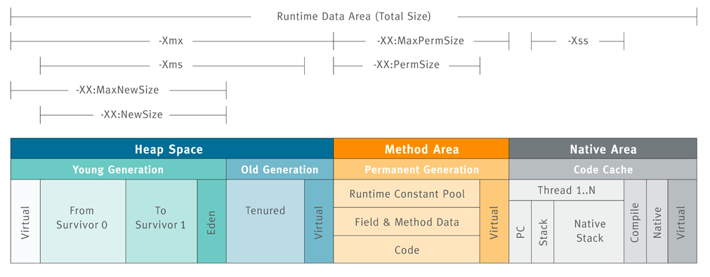

JVM内存结构：

1. 堆（Heap）：线程共享。对象实例和数组都在堆上分配。回收器管理的对象。
2. 方法区（Method Area）：线程共享。存储类信息、常量、静态变量、即时编译器编译后的代码。
3. 方法栈（JVM Stack）：存储局部变量表、操作栈、动态链接、方法出口，对象指针。
4. 本地方法栈（Native Method Stack）：为虚拟机使用到的Native 方法服务。如Java使用c或者c++编写的接口服务时，代码在此区运行。
5. 程序计数器（Program Counter Register）：线程私有。只想下一条要执行的指令。

对象创建后被分配在Eden区，经过一次**Young GC**后，对象会被复制到**Survivor 0**区。下一次会被复制到Survivor 1区。

Survivor中的对象在达到GC阈值后被复制到老年代，空出Suvivor 0。

好处

1. 使用Young GC替代老年代的Full GC提高性能
2. 是可以减少内存碎片

最好的比例：8:1:1