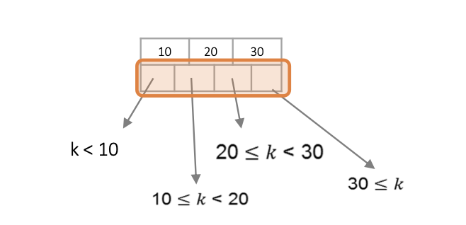
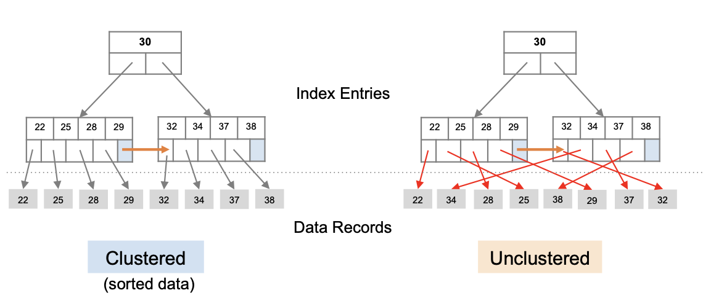

---
layout: post
title: "B+ Tree Indexing"
date: 2025-09-04
categories: database
tags: [database, sql]
---
### Features
- 1 node = 1 physical page
- Always balanced
- Splits at the root (by insertion and deletion)
- Leaves form a linked list (for range queries)
- B+ tree is suitable for answering point and range queries
- High fanout, small depth

### Non-leaf node
Each non-leaf node has x keys and x+1 pointers. x keys define x+1 ranges.
Each non-left node is at least partially full.

### Leaf node
Leaf nodes contain a pointer to the next leaf node for faster sequential scan.
叶子结点的最后一个指针，不指向具体数据，而是指向下一个叶子结点。
The other n pointers in a leaf block, at least $\frac{(n+1)}{2}$ of these pointers are used and point to data records. Because each block must have half data, else it should be divided into two leaves.

### Insertion
1. Find a place for the new key in the appropriate leaf; put it there if there is room.
2. No room, split the leaf into two and divide the keys between the two nodes(each is half or just over half full)
3. Root full, split the root and create a root at higher level

### Delection
Start at root, find leaf L where entry belongs
Remove the entry
+ if L more than half, done
+ else
  + Redistribute: borrowing a key from adjacent node with same parent node of L
  + Cannot redistribute: merge L and adjacent node, delete entry to L or adjacent node, do merge propagate. (Merge could propagate to root, decreasing height)

### Size of B+ Tree
f: fanout (the number of pointers of a node)
N: total number of records
F: fill factor(slack for insertions)
B+ tree needs nodes for N/F pages
$$
height = log_f\frac{N}{F}
$$
Suppose height of a B+ tree is $h$, this tree have $f^{h-1}$ leaf nodes, room to index $f^h$ records.
E.g. a block of B+ tree has 255 pointers and the tree 3 levels, the tree can files with up to $255^3$ about 16.6 million records.

### Cost
|     Operations    | Cost    |
| ----------- | ----------- |
| Search   | $log_f\frac{N}{F} - L_B + 1$ |
| Self-Balancing | Neglect |
| Insertion| $log_f\frac{N}{F} - L_B + 2$|
|Deletion|$log_f\frac{N}{F} - L_B + 2$|

#### Search Cost

$$
log_f\frac{N}{F} - L_B + 1
$$

#### Cost of Self-Balancing

If the number of keys per block, is reasonably large, then splitting and merging of blocks will be rare events.

Furthermore, when such an operation is needed, it almost always is limited to the leaves, so only two leaves and their parent are affected.

Thus, we can essentially neglect the disk-I/O cost of B-tree reorganizations.

#### Cost of insertion/Deletion

Cost: find a pointer to the record (=height) + the one (for lookup) or two (for insert or delete) I/Os

#### Clustered vs. Unclustered Index

| Cost        | 1 record    | R records                     |
| ----------- | ----------- | ----------------------------- |
| Clustered   | 1 random IO | 1 random IO + R sequential IO |
| Unclustered | 1 random IO | R random IO (worst case)      |

+ To build a clustered index, first sort the heap file
  + Leave some space in each block for record insertion
+ To insert into a clustered index
  + Find the corresponding block using the index (if lucky there is space)
  + If no enough space, allocate a block at the end of the heap file
The file is “almost” sorted based on the index key
Performance degradation：Lazy on-the-fly reorganization
