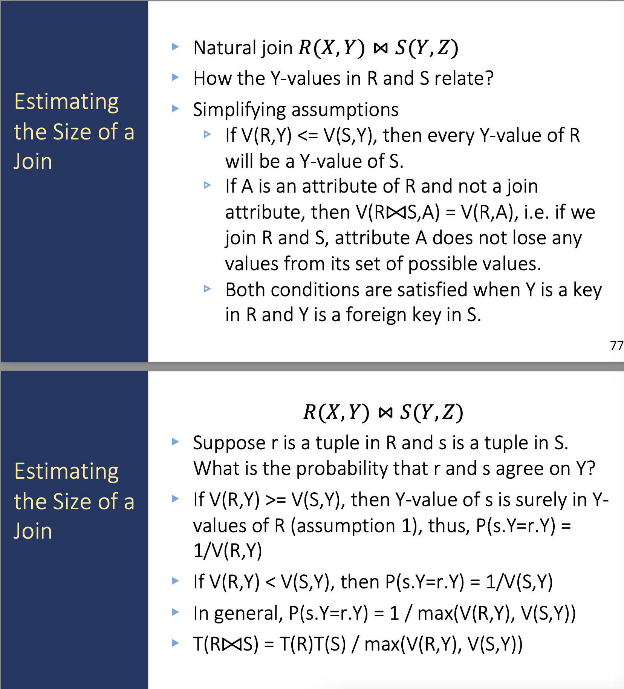

---
layout: post
title: "Estimating the Size of Result"
date: 2025-09-05
categories: database
tags: [database, sql]
---
##### Cardinality Estimation

Given a database D and an query Q, the cardinality of Q w.r.t. the database D, namely$|Q(D)|$, is the number of rows returned by query Q.

+ Sampling-based: 取出一部分tuples作为样本，计算结果的Cardinality，然后按照倍数scaling up到整个数据库
+ Learning-based: Prediction: 学习出一个 Query 到 Cardinality 的映射函数
+ Histogram-based: 观察历史数据来模型化数据分布，来评估输出大小

使用histogram-based评估：$T(R)T(S)/max(V(R,Y), V(S,Y))$
V is the number of distinct value in a relation.

![[Pasted image 20230401212554.png]]
