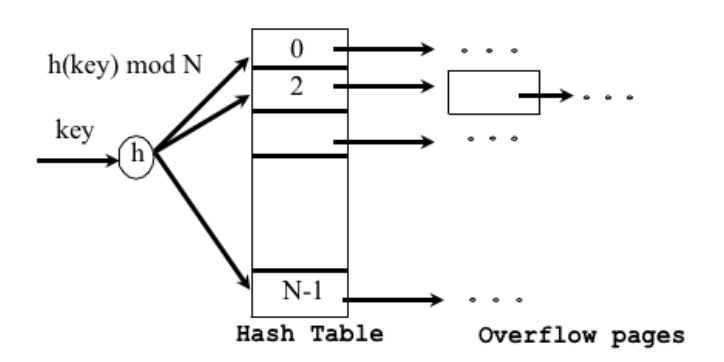

Finding the first block for any bucket i

A main-memory array of pointers to blocks, indexed by bucket number

Put the first block for each bucket in fixed consecutive disk locations, so we can compute the location of bucket i

##### Cost

If the records of each bucket fit in one block:

Lookup: one disk I/O, better than B+ tree

Deletion and insertion: two disk I/O's

##### Limitations

Cannot support range queries.

Long overflow chains (due to data skew 数据偏差) can develop and degrade performance. 如果所有的数据的key都被映射到同一个值, 链上的值很多，导致计算时间增长。

