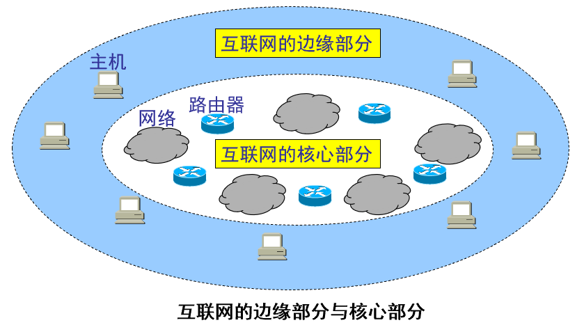

---
layout: post
title: "概述 2075cd5a53c240508f2272b502fd271d"
date: 2025-09-05
categories: network
tags: [network, protocol]
---
# 概述

# 1.1 计算机网络信息时代中的作用

随着技术的发展，网络技术相互融合

互连网：在局部范围互联起来的计算机网络

互联网：世界上最大的计算机网络

互联网两个重要基本特点：连通性（用户之间交换信息） 共享（资源共享——信息，软件，硬件共享）

# 1.2互联网概述

计算机网络：由若干结点和连接这些结点的链路组成

与网络相连的计算机常称为主机

网络把许多计算机连接在一起

互连网则把许多的网络通过路由器连接在一起

互联网的起源：ARPANet

<aside>
💡 互连网服务提供者 ISP (Internet Service  Provider)
根据提供服务的覆盖面积大小以及所拥有的IP地址数目的不同，ISP也分成不同层次的ISP，主干ISP、地区ISP和本地ISP

</aside>

# 1.3 互联网的组成

## 互联网的边缘部分和核心部分

1. 边缘部分（资源子网）：所有连接在互连网上的主机组成，用户可以直接使用，用来进行通信（传送数据、音频或视频）和资源共享
2. 核心部分（通信子网）：由大量网络和链接这些网路的路由器组成。这部分是为边缘部分提供服务的（提供连通性和交换）

---

## 边缘部分

<aside>
💡 处在互联网边缘部分就是连接在互联网上的所有主机。这些主机又称为端系统

</aside>

### 端系统之间通信的含义

A机上的程序和B机上的另一个程序通信——简称“计算机之间通信”

### 端通信的两种方式

- 客户服务器方式
    - 客户为服务请求方，服务器为服务提供方，都要使用网络核心部分提供的服务
    - 客户知道服务器地址，服务器不知道客户地址
    - 客户程序，被用户调用后运行
    - 服务器程序，系统启动后一直运行，被动的等待客户程序的通信请求，所以不需要知道地址
    - 通信是双向的，都可以接收发送数据
    
    
    
- 对等方式（P2P）
    - 每个主机既是主机也是客户机
    - 对等访问
    - 两个主机都运行了对等的连接软件（P2P软件），它们就可以平等的、对等连接的通信
    - 支持大量对等用户同时工作
    
    
    

---

## 核心部分

向边缘主机提供连通性，使边缘部分的任何主机都能够向其他主机通信

起特殊作用的是路由器

<aside>
💡 路由器：
实现分组交换的关键部件，转发收到的分组，这是网络核心部分最重要的功能。

</aside>

为了理解分组交换，首先了解电路交换基本概念

[电路交换](%E6%A6%82%E8%BF%B0%202075cd5a53c240508f2272b502fd271d/%E7%94%B5%E8%B7%AF%E4%BA%A4%E6%8D%A2%2075ad7d54513844a7b5a803ffab421b25.md)

### 分组交换

特点

- 采用存储转发技术
- 先把长的报文，划分为短的，固定长度的数据段

分组传输单元：

- 每一个数据段前面添加上首部构成分组(packet)
- 以分组作为数据传输单元
- 依次把各分组发送到接收端

分组首部的重要性

- **每一个**分组的首部都含有地址（诸如目的地址和源地址）等控制信息。
- **分组交换网中的结点交换机根据收到的**分组首部中的地址信息，把分组转发到下一个结点交换机
- **每个分组在**互联网中独立地选择传输路径
- **用**这样的存储转发方式，最后分组就能到达最终目的地

收到分组后剥离首部，还原成原来的报文

### 互联网的核心部分

互联网的核心部分是由许多网络和把它们互连起来的路由器组成，而主机处在互联网的边缘部分。

互联网核心部分中的路由器之间一般都用高速链路相连接，而在网络边缘的主机接入到核心部分则通常以相对较低速率的链路相连接。

主机的用途是为用户进行信息处理的，并且可以和其他主机通过网络交换信息。路由器的用途则是用来转发分组的，即进行分组交换的。

查找转发表找到转发的端口

### 路由器

路由器中的输入和输出之间没有直接连线

处理分组的过程：

1. 把收到的分组放入缓存
2. 查找转发表，找到某个目的地址应从那个端口转发
3. 把分组送到适当的端口

### 主机和路由器的作用不同

主机是为用户进行信息处理的，并向网络发送分组，从网络接收分组

路由器对分组进行存储转发，最后把分组交付目的主机

### 分组交换的优点和缺点

优点：

1. 高效：动态分配传输带宽
2. 灵活：为每个分组独立选择最合适的转发路由
3. 迅速：可以不先建立连接就能向其他主机发送分组
4. 可靠：保证可靠性的网络协议；分布式多路由的分组交换网，是网络有很好的生存性

缺点：

分组在各结点存储转发需要排队，造成时延

分组必须携带首部，造成一定开销

### 存储转发原理并非新的概念

连续传送大量数据，传送时间大于建立时间——>电路交换的速率快

传输突发数据——> 分组交换，相比报文时延小更灵活

---

# 1.4 计算机网络在我国的发展

---

# 1.5 计算机网络的类别

---

# 1.6 计算机网络的性能

## 4. 时延

数据从网络的一段传送到另一端所需的时间

$$
总时延= 发送时延+传播时延+处理时延+排队时延
$$

### 发送时延（传输时延）

从发送数据帧的第一个比特算起，到最后一个比特发送完毕所需的时间

$$
⁍
$$

### 传播时延

在信道中传播一定距离花费的时间

与发送速率不同

$$
传播时延 = 信道长度（米）
/信号在信道上的传播速率（米/秒）
$$

### 处理时延

主机或路由器在收到分组时，为处理分组（例如分析首部、提取数据、差错检验或查找路由）所花费的时间。

### 排队时延

分组在路由器输入输出队列中排队等待处理所经历的时延。

排队时延的长短往往取决于网络中当时的通信量。

### 容易产生的错误概念

对于高速网络链路，提高的仅仅是发送速率而不是传播速率

提高链路带宽减小了数据的发送时延

### 时延带宽积

链路的时延带宽积又称为以比特为单位的链路长度

$$
时延带宽积=传播时延*带宽
$$

只有链路的管道都充满比特，链路才得到了充分利用

### 往返时间RTT

往返时间表示从发送方发送数据开始，到发送方收到来自接收方的确认，总共经历的时间。

在互联网中，往返时间还包括各中间结点的处理时延、排队时延以及转发数据时的发送时延

### 利用率

信道利用率：指出某信道有百分之几的时间是被利用的（有数据通过）。完全空闲的信道的利用率是零。

网络利用率：则是全网络的信道利用率的加权平均值。

信道利用率并非越高越好。当某信道的利用率增大时，该信道引起的时延也就迅速增加。
